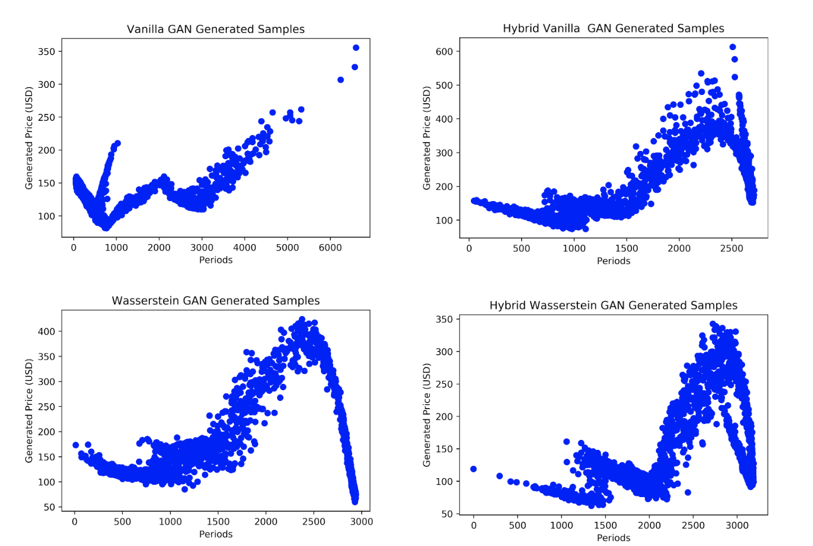

# Generative Adversarial Network Modelling of Financial Time Series (Oscar Levy, 2020)

A Wasserstein approach to modelling financial time-series distributions.

Dependencies :
- Python 3.7
- Tensorflow 1.15
- Numpy 1.18.1
- Matplotlib 3.1.1
- Statsmodels 0.11

Running the models :
- To run the models,  'python filename.py' and the main methods should execute in the case of normal scripts
- For GAN models with classes,  run gan = GAN(parameters) and gan.train()
